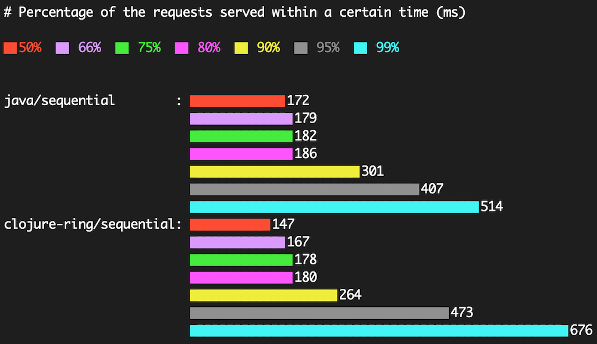

This is a test for Sequential vs Concurrent approach on Java Rapidoid, Go net/http package and NodeJS

## Setup

### Java
- JDK8

### DB
```
$ sqlite3 sample.db
sqlite> CREATE TABLE tokens(id INTEGER PRIMARY KEY, encoded_token VARCHAR(255) NOT NULL);
```

## Benchmark
```
$ ab -n 50 -c 50  http://localhost:8080/stress/5

$ termgraph bm.dat --format '{:.0f}' --color {red,blue,green,magenta,yellow,black,cyan}  --title "Percentage of the requests served within a certain time (ms)"
```

A round number on
```
MacBook Pro (Retina, 15-inch, Mid 2015)
Processor 2.2 GHz Intel Core i7
Memory 16 GB 1600 MHz DDR3
```

